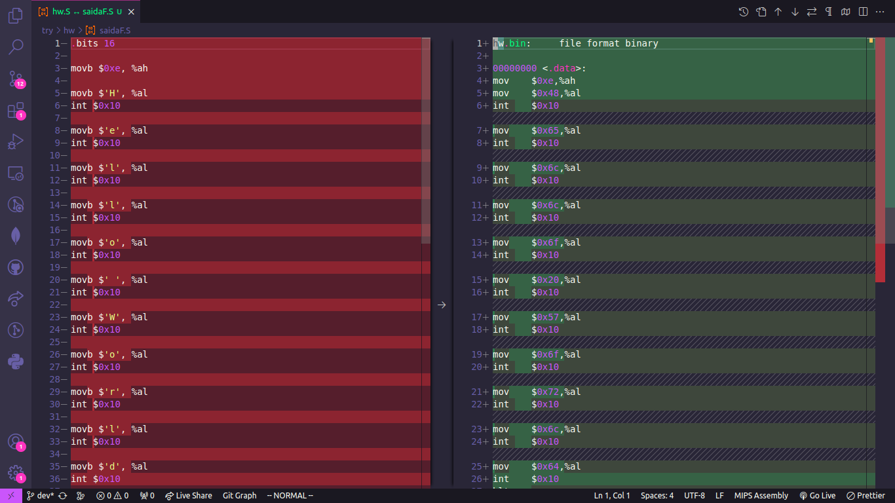
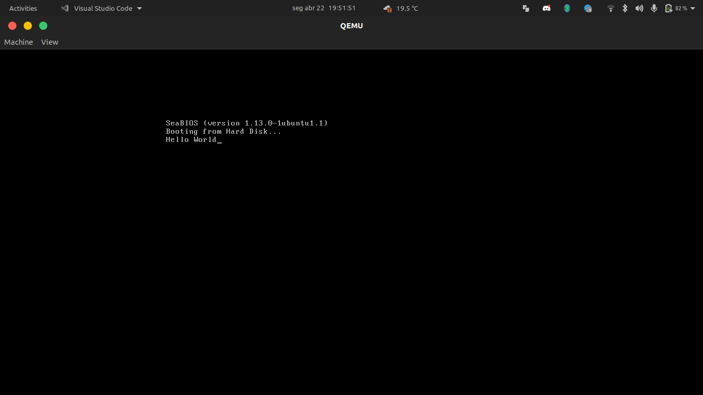

## Solving Hello World

### Members

- Felipe Cadavez Oliveira 11208558
- Luiz Fernando Rabelo 11796893

### Notes

#### d)

    d) Compare 'hw.bin' with 'eg.bin'.

    Tip:   make a16 hw.bin <path>/eg.bin

    Do the outputs match? (They don't necessarily have too).

In our case both files match each other. To make sure of that
we export the hexdump file of each one (hw.bin and eg.bin), to
two different files and ran the command

```shell
diff hexdump_hw_bin.hex hexdump_eg_bin.hex
```

The output showed us that the files had no differences between them.

#### e)

    e) Disassemble 'hw.bin' and compare the result with 'hw.S'.

       Tip:   make hw.bin/a16

       Does the output (at least approximately) matches 'hw.S'?

Yes, the output approximately matches 'hw.S', the main difference was that on the hw.S the characters was on ascii form and on the disassemble output the characters was on hexadecimal code. We can see it on the picture diff.png



#### f)

    f) Boot 'hw.bin' using the 'qemu' emulator.

       Tip:   make hw.bin/run

       Does it work?

It worked, it printed the phrase 'Hello World'. We can see a printscreen of the result on the picture qemu.png 
